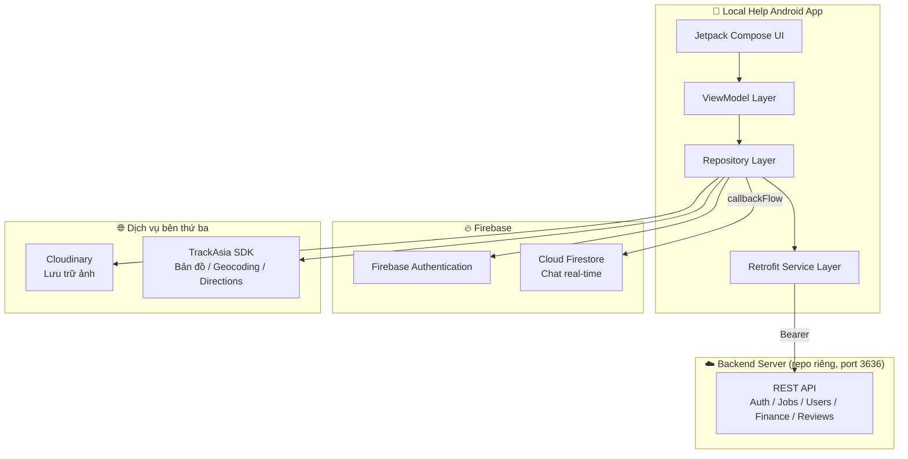
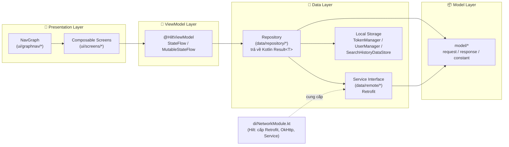
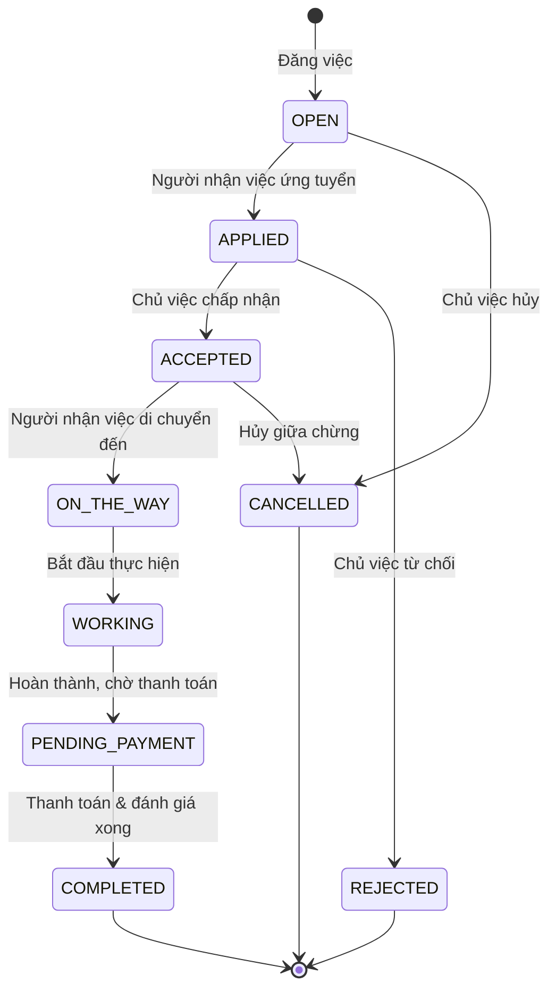
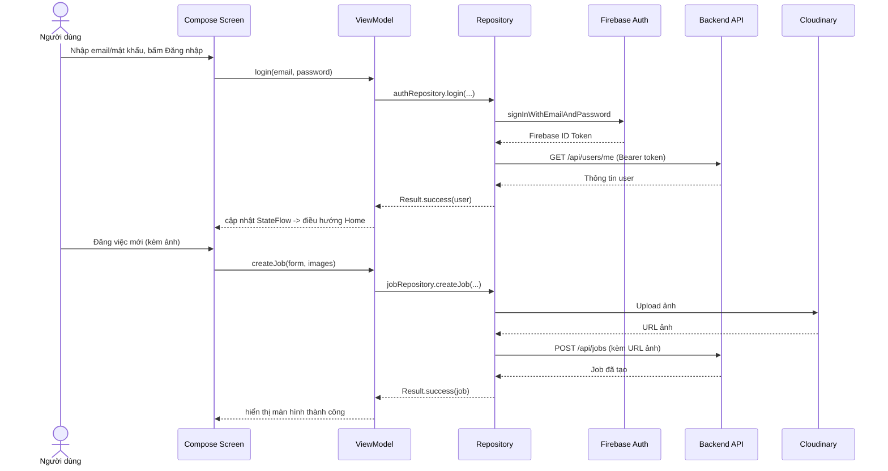
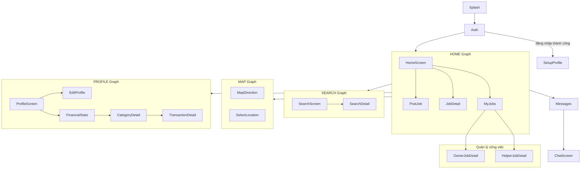

# Local Help — Giúp nhau quanh đây

**Local Help** là ứng dụng Android kết nối **người cần thuê việc vặt** (đăng việc) với **người nhận việc** (giúp việc) theo khu vực địa lý gần nhau. Ứng dụng hỗ trợ đăng/ứng tuyển công việc, theo dõi tiến độ theo thời gian thực trên bản đồ, nhắn tin trực tiếp, thanh toán và đánh giá sau khi hoàn thành.

> Package: `com.localhelp.app` · Ngôn ngữ: Kotlin · UI: Jetpack Compose

---

## Mục lục

1. [Tính năng chính](#tính-năng-chính)
2. [Công nghệ sử dụng](#công-nghệ-sử-dụng)
3. [Phân tích & thiết kế kiến trúc](#phân-tích--thiết-kế-kiến-trúc)
4. [Cấu trúc thư mục](#cấu-trúc-thư-mục)
5. [Luồng nghiệp vụ chính](#luồng-nghiệp-vụ-chính)
6. [Cài đặt & chạy dự án](#cài-đặt--chạy-dự-án)
7. [Cấu hình môi trường](#cấu-hình-môi-trường)
8. [Định hướng phát triển](#định-hướng-phát-triển)

---

## Tính năng chính

| Nhóm | Tính năng |
|---|---|
| Tài khoản | Đăng ký, đăng nhập, quên mật khẩu qua OTP (deep-link `localhelp://reset`), thiết lập hồ sơ |
| Công việc | Đăng việc (kèm ảnh, vị trí, giá), chỉnh sửa/hủy việc, tìm kiếm & lọc việc gần đây |
| Vòng đời công việc | Ứng tuyển, nhận việc, theo dõi trạng thái (`OPEN → ACCEPTED → ON_THE_WAY → WORKING → PENDING_PAYMENT → COMPLETED`) |
| Bản đồ | Xem vị trí, chỉ đường/điều hướng tới nơi làm việc (TrackAsia SDK) |
| Nhắn tin | Chat thời gian thực giữa người đăng việc và người nhận việc (Firebase Firestore) |
| Tài chính | Thống kê thu nhập/chi tiêu, chi tiết giao dịch theo danh mục |
| Đánh giá | Đánh giá đối tác sau khi hoàn thành công việc |

## Công nghệ sử dụng

| Thành phần | Công nghệ |
|---|---|
| Ngôn ngữ | Kotlin 2.0.21 |
| UI | Jetpack Compose (Material3), Navigation Compose |
| Kiến trúc | MVVM + Repository pattern |
| Dependency Injection | Hilt 2.52 |
| Bất đồng bộ | Kotlin Coroutines + Flow (`StateFlow`, `callbackFlow`) |
| Gọi API | Retrofit 2.9 + OkHttp (2 instance: backend nội bộ & TrackAsia) |
| Xác thực | Firebase Authentication (ID token dùng làm Bearer token cho backend) |
| Chat real-time | Firebase Firestore |
| Lưu trữ cục bộ | SharedPreferences (token), Jetpack DataStore (lịch sử tìm kiếm) |
| Upload ảnh | Cloudinary (upload trực tiếp từ client) |
| Bản đồ & chỉ đường | TrackAsia SDK (geocoding, reverse geocoding, autocomplete, directions) |
| Ảnh | Coil (kể cả `coil-svg`) |
| Build | Gradle (AGP 8.7.3), KSP, `compileSdk 35`, `minSdk 26`, `targetSdk 35` |

> Backend (REST API, cổng `3636`) là một dịch vụ **tách biệt**, không nằm trong repo này — ứng dụng chỉ đóng vai trò client.

---

## Phân tích & thiết kế kiến trúc

### 1. Kiến trúc tổng thể hệ thống

Ứng dụng Android đóng vai trò client, giao tiếp với 3 nhóm dịch vụ backend độc lập:



**Điểm đáng chú ý:**
- Firebase Auth chỉ dùng để **định danh** (sinh ID token), toàn bộ dữ liệu nghiệp vụ (job, user, finance...) do backend riêng quản lý.
- Cloudinary được gọi **trực tiếp từ client** để upload ảnh (không qua backend) — backend chỉ nhận URL ảnh trả về.
- `AuthInterceptor` tự động gắn Firebase ID token vào header `Authorization`; `TokenAuthenticator` xử lý refresh khi gặp lỗi 401.

### 2. Kiến trúc client (MVVM + Repository)



Đây là mô hình **MVVM thực dụng** (không tách `domain`/`usecase` riêng như Clean Architecture chuẩn) — logic nghiệp vụ được đặt trực tiếp trong ViewModel, có chú thích rõ theo dạng "use case" (ví dụ: tạo/sửa/hủy công việc, khôi phục mật khẩu) để dễ theo dõi luồng xử lý.

### 3. Sơ đồ trạng thái vòng đời công việc (Job)



### 4. Luồng dữ liệu khi đăng nhập & đăng việc



### 5. Sơ đồ điều hướng (Navigation Graph)



Điều hướng dưới cùng (Bottom Navigation) gồm 5 mục: **Khám phá** (Home), **Việc đã đăng** (My Jobs), **Đăng việc** (FAB giữa), **Tin nhắn** (Messages), **Cá nhân** (Profile).

---

## Cấu trúc thư mục

```
app/src/main/java/com/localhelp/app/
├── LocalHelpApplication.kt     # Khởi tạo Hilt, Firebase, Cloudinary, Coil
├── MainActivity.kt             # Activity duy nhất, xử lý deep-link reset mật khẩu
├── di/
│   └── NetworkModule.kt        # Cấu hình Retrofit/OkHttp & cung cấp các Service
├── data/
│   ├── local/                  # TokenManager, UserManager, SearchHistoryDataStore, MainViewModel
│   ├── remote/                 # Interface Retrofit: AuthService, JobService, UserService, ...
│   └── repository/             # Repository theo domain: JobRepository, ChatRepository, ...
├── model/
│   ├── constant/                # JobStatus, UserRole, UserStatus, GenderEnum
│   ├── request/                 # CreateJobRequest, SearchJobRequest, ...
│   └── response/                # ApiResponse<T>, JobResponse, UserResponse, ...
├── ui/
│   ├── graphnav/                # Định nghĩa các NavGraph theo tính năng
│   ├── screens/                 # Màn hình Compose + ViewModel tương ứng (theo tính năng)
│   ├── common/                  # Composable dùng chung (bottom nav, item list, ...)
│   └── theme/                   # Theme, màu sắc, typography
└── utils/                       # CloudinaryHelper, FormatterUtils, TypeAdapter cho TrackAsia
```

## Luồng nghiệp vụ chính

- **Xác thực**: Đăng ký/đăng nhập qua Firebase Auth → lấy ID token → gọi API backend để đồng bộ hồ sơ. Quên mật khẩu theo 3 bước: gửi OTP → xác thực OTP → đặt lại mật khẩu (`ForgotPasswordViewModel`).
- **Đăng việc**: Chọn danh mục, nhập thông tin, chọn vị trí trên bản đồ, đính kèm ảnh (upload Cloudinary trước, sau đó gửi URL kèm dữ liệu việc lên backend) — dùng chung form cho cả tạo mới và chỉnh sửa (`CreateJobViewModel`).
- **Nhận việc**: Người nhận việc tìm/lọc công việc gần vị trí hiện tại, xem chi tiết, ứng tuyển; chủ việc duyệt và theo dõi tiến độ qua các trạng thái `JobStatus`.
- **Chat**: Khi một công việc được chấp nhận, cuộc trò chuyện giữa hai bên được đồng bộ real-time qua Firestore (`ChatRepository`, dùng `callbackFlow`).
- **Tài chính**: Sau khi hoàn thành công việc, giao dịch được ghi nhận và hiển thị dưới dạng thống kê thu/chi theo danh mục.

---

## Cài đặt & chạy dự án

### Yêu cầu

- Android Studio (Ladybug trở lên khuyến nghị) với AGP 8.7.3+
- JDK 11
- Một backend API tương thích chạy ở `http://localhost:3636` (khi test bằng emulator, ứng dụng gọi tới `http://10.0.2.2:3636`)

### Các bước

```bash
git clone <repo-url>
cd local-help-app
```

1. Thêm file `app/google-services.json` (đã có sẵn trong repo, ứng với project Firebase `local-help-backend`).
2. Tạo file `local.properties` ở thư mục gốc và bổ sung khóa TrackAsia:
   ```properties
   sdk.dir=<đường dẫn Android SDK>
   TRACK_ASIA_PRIVATE_KEY=<khóa API TrackAsia của bạn>
   ```
3. Mở dự án bằng Android Studio, đợi Gradle sync.
4. Chạy backend tương ứng ở cổng `3636` (hoặc cập nhật `ApiConstants.BASE_URL` cho môi trường của bạn).
5. Chạy ứng dụng trên emulator hoặc thiết bị thật (`Run ▶`).

## Cấu hình môi trường

| Biến / File | Vai trò |
|---|---|
| `local.properties` → `TRACK_ASIA_PRIVATE_KEY` | Sinh `BuildConfig.TRACK_ASIA_API_KEY`, dùng cho bản đồ/chỉ đường |
| `app/google-services.json` | Cấu hình Firebase Authentication & Firestore |
| `ApiConstants.BASE_URL` | Địa chỉ backend REST API (mặc định trỏ tới emulator host) |
| Cloudinary (`cloud_name`, `upload preset`) | Cấu hình trong `LocalHelpApplication.kt` |

> Lưu ý bảo mật: `local.properties` không được commit (đã có trong `.gitignore`); `google-services.json` hiện đang được commit — cân nhắc xoay khóa nếu repo public.

## Định hướng phát triển

- Bổ sung tầng `domain`/`usecase` tách biệt khỏi ViewModel để dễ kiểm thử và mở rộng (Clean Architecture).
- Viết unit test cho Repository/ViewModel (hiện chưa có test coverage thực tế).
- Thiết lập CI/CD (hiện chưa có pipeline).
- Xem xét thay `SharedPreferences` bằng DataStore đồng bộ cho toàn bộ phiên đăng nhập.
